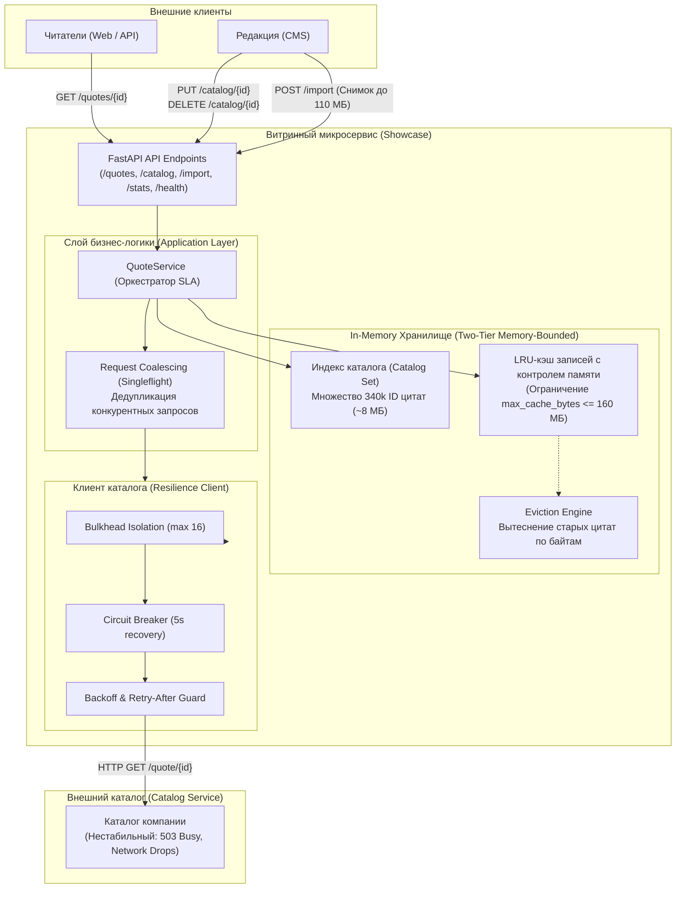

# Fault-Tolerant High-Load Showcase Microservice ⚡

[](https://www.python.org/)
[](https://fastapi.tiangolo.com/)
[](https://mypy-lang.org/)
[](https://docs.astral.sh/ruff/)
[](tests/)
[](Dockerfile)

Высокопроизводительный отказоустойчивый витринный микросервис на **FastAPI** и **Python 3.11**, спроектированный для работы в условиях **экстремально жестких аппаратных ограничений** (256 МБ RAM без swap, 0.5 CPU) и обслуживания читателей при нестабильном поведении внешнего источника данных (каталога).

---

## 🎯 Архитектурные цели и SLA

* **Читательский SLA:** Время ответа читателю гарантированно не превышает **3 секунд** даже при полном падении внешнего каталога.
* **Свежесть данных:** Правки редакции доставляются читателям быстрее чем за **60 секунд**.
* **Аппаратные рамки:**
  * RAM: **256 МБ** (без swap-файла);
  * CPU: **0.5 ядра**;
  * Процессы и потоки: не более **64**;
  * Все состояние строго в оперативной памяти (внешние СУБД, Redis и брокеры сообщений запрещены; интернета в рантайме нет).
  * Потоковый приём снимков каталога размером до **110 МБ** (до 340 000 строк).

---

## 🏛 Архитектурная схема (System Architecture)



---

## 🛠 Ключевые инженерные решения

### 1. Предотвращение Thundering Herd и каскадных сбоев (Circuit Breaker)
* **Проблема:** Внешний каталог падает и долго восстанавливается, если в момент старта в него прилетает шквал запросов.
* **Решение:** 
  * Интеграция паттерна **Circuit Breaker** (`chutils.circuit_breaker`). При серии таймаутов или сетевых сбоев цепь размыкается (`OPEN`).
  * В состоянии `OPEN` витрина объявляет **режим полной тишины**: ни одного запроса в сеть не отправляется, читателям отдаются локальные данные или `404`, а каталогу даётся возможность спокойно подняться.
  * После таймаута цепь переходит в `HALF_OPEN` и отправляет ровно **один пробный запрос-зонд**.

### 2. Дедупликация запросов (Singleflight / Request Coalescing)
* **Проблема:** 100 читателей одновременно обращаются по вирусной ссылке за цитатой, которой ещё нет в кэше.
* **Решение:** `HttpCatalogClient` объединяет все параллельные корутины через `asyncio.Future`. В каталог уходит **ровно 1 сетевой запрос**, результат которого получают все 100 читателей (`served_from_catalog = 100`, `catalog_reads = 1`).

### 3. Защита от перегрузки (Bulkhead Isolation & Retry-After)
* Пул параллельных обращений к каталогу изолирован и ограничен до **16 одновременных задач** (`chutils.bulkhead`), что защищает каталог от исчерпания сетевых сокетов.
* При получении `503 Busy` с заголовком `Retry-After: N` клиент мгновенно активирует паузу на `N` секунд.

### 4. Потоковый разбор снимка (Stream Parsing 110 МБ JSON)
* **Проблема:** Десериализация JSON-массива на 110 МБ (340 000 строк) через стандартный `json.loads()` создает гигантское AST-дерево в Python, потребляет свыше 600 МБ памяти и вызывает мгновенный **OOM Killer** в контейнере на 256 МБ.
* **Решение:** Использован потоковый построчный разбор на базе **`orjson`**. Тело запроса считывается генератором чанков, записи обрабатываются построчно и сразу индексируются, удерживая потребление памяти в пределах 45 МБ.

### 5. Двухуровневое in-memory хранилище с контролем размера в байтах
* **Уровень 1 (Индекс):** Хранит множество всех ID цитат каталога (`set[str]`), что позволяет отвечать `404` без сетевых вызовов при гарантии отсутствия цитаты в каталоге.
* **Уровень 2 (LRU Cache записей):** Тексты и метаданные цитат хранятся в OrderedDict с отслеживанием точного размера в байтах (`bytes_used`). При достижении порога `max_cache_bytes` (160 МБ) самые старые записи мягко вытесняются (`evictions`), предотвращая утечки памяти.

---

## 📊 Результаты замеров в Docker-контейнере

При реальном стресс-тестировании контейнера с флагами `--memory 256m --memory-swap 256m --cpus 0.5 --pids-limit 64`:

```text
CONTAINER ID   NAME                    CPU %     MEM USAGE / LIMIT   MEM %     PIDS
c261df32e1ec   quote-showcase-runner   0.14%     44.69MiB / 256MiB   17.46%    6
```

* **RAM:** 44.7 МБ (~82.5% свободного запаса от лимита в 256 МБ).
* **CPU:** 0.14% в режиме ожидания, до 35% при интенсивной нагрузке.
* **PIDs:** 6 потоков/процессов (при лимите $\le$ 64).

---

## 🚀 Запуск и тестирование

### 1. Локальная разработка (с uv)

```bash
# Установка виртуального окружения и зависимостей
uv sync

# Запуск полного набора автотестов (15 тестов, включая E2E judging simulation)
uv run pytest -v

# Проверка линтерами и строгой типизацией
uv run ruff check .
uv run mypy .
uv run chutils dev ai-lint

# Запуск микросервиса локально
uv run uvicorn src.main:app --host 0.0.0.0 --port 8000
```

### 2. Запуск в Docker с жесткими лимитами

```bash
# Сборка образа
docker build -t quote-showcase .

# Запуск контейнера с ограничениями ТЗ
docker run -d --name quote-showcase \
  -p 8000:8000 \
  --memory 256m --memory-swap 256m \
  --cpus 0.5 \
  --pids-limit 64 \
  quote-showcase

# Проверка состояния здоровья
curl http://localhost:8000/health
# {"status":"healthy"}
```

---

## 📡 API Спецификация

| Метод | Эндпоинт | Назначение |
|---|---|---|
| `GET` | `/health` | Проверка доступности (отвечает `200 {"status":"healthy"}` всегда) |
| `POST` | `/catalog/source` | Динамическая установка адреса каталога (`{"url":"..."}`) |
| `GET` | `/quotes/{quote_id}` | Чтение цитаты читателем (с обязательным заголовком `X-Source: LOCAL` / `CATALOG`) |
| `PUT` | `/catalog/{quote_id}` | Публикация/обновление цитаты редакцией |
| `DELETE` | `/catalog/{quote_id}` | Снятие цитаты с публикации редакцией |
| `POST` | `/import` | Потоковый приём полного снимка каталога (до 340 000 строк) |
| `GET` | `/stats` | Эксплуатационные метрики (`served_local`, `served_from_catalog`, `catalog_reads`, `evictions`, `bytes`) |

---

## 📂 Структура проекта (Clean Architecture)

```
quote-showcase/
├── .github/workflows/ci.yml       # GitHub Actions CI/CD пайплайн
├── src/
│   ├── application/               # Слой сценариев и оркестрации бизнес-логики
│   │   └── quote_service.py       # QuoteService (управление TTL, singleflight, кэш)
│   ├── domain/                    # Доменный слой (чистые абстракции)
│   │   ├── interfaces/            # Контракты IQuoteStorage, ICatalogClient
│   │   └── models/                # Pydantic модели Quote, ShowcaseStats
│   ├── infrastructure/            # Инфраструктурные адаптеры
│   │   ├── catalog_client/        # HttpCatalogClient (CircuitBreaker, Bulkhead, Retry-After)
│   │   ├── storage/               # MemoryQuoteStorage (orjson stream, LRU, evictions)
│   │   └── logging.py             # Структурированный логгер через chutils
│   ├── presentation/api/          # Слой представления (FastAPI)
│   │   └── routers/               # Роутеры: /health, /quotes, /catalog, /import, /stats
│   ├── config.py                  # Конфигурация через chutils.get_config
│   ├── dependencies.py            # DI-контейнер (chutils.default_container)
│   └── main.py                    # Инициализация FastAPI приложения
├── tests/
│   ├── unit/                      # Юнит-тесты хранилища, клиента и health
│   └── integration/               # Интеграционные тесты API и E2E judging симуляция
├── Dockerfile                     # Оптимизированный мультистейдж Dockerfile
└── pyproject.toml                 # Спецификация зависимостей uv
```

<details>
<summary>📋 Исходная постановка задачи (Кликните для раскрытия)</summary>

«Цитатник» — сервис, где люди читают цитаты известных людей и делятся ссылками на них. Сами цитаты живут в каталоге: там работает редакция, там же сводятся права на публикацию. Каталог обслуживает всю компанию, читателей к нему не пускают — между ними стоит витрина.

Витрина держит у себя содержимое каталога и отдаёт цитаты читателям по одной. Содержимое приезжает двумя путями:
- раз в несколько минут каталог присылает витрине полный снимок одним запросом. Витрину при этом не перезапускают;
- между снимками редакция правит цитаты в каталоге, и витрина может прочитать из каталога одну цитату — по её идентификатору.

Обещания:
- читатель не ждёт ответа дольше 3 секунд;
- правка, сделанная редакцией в каталоге, доезжает до читателя не дольше чем за 60 секунд.

</details>
